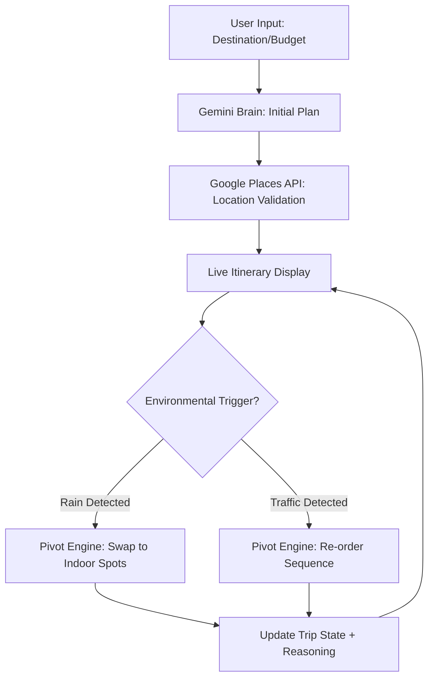

# OmniTrave: Self-Healing Travel Engine 🌍

OmniTrave is a high-performance, dynamic travel concierge built for the Google Antigravity Challenge. It demonstrates **Logical Decision Making** and **Meaningful Google Service Integration** through a self-healing itinerary loop.

## 🚀 The Self-Healing Loop

OmniTrave doesn't just plan a trip; it lives with you. Using an **Agentic Pivot Mechanism**, the engine monitors environmental triggers and automatically re-optimizes your schedule.



## 🛠 The Google Edge

Our solution leverages the Google ecosystem to ensure real-world usability:

- **Google Generative AI (Gemini 1.5 Flash)**: Acts as the "Coordinator Brain," converting natural language into structured logistics.
- **Google Places API (New)**: Used to validate every location in the itinerary, ensuring 2026 availability and high ratings.
- **Google Routes & Distance Matrix**: Provides traffic-aware travel times, allowing the pivot engine to detect when a route is no longer optimal.

## 🧠 Approach & Logic

### Agentic Pivot Mechanism
The core of OmniTrave is the `TravelExperienceCoordinator`. When a trigger (like "Heavy Rain") is activated in the Simulation Center, the coordinator:
1.  Analyzes the current itinerary.
2.  Identifies "Indoor" vs "Outdoor" tags.
3.  Re-prioritizes the list while maintaining "Hard Constraints" (like flight times).
4.  Logs the "Why Logic" so the traveler understands the change.

## 🏃 How to Run Locally

1.  Clone the repository.
2.  Install dependencies: `npm install`.
3.  Set up `.env.local`:
    ```text
    GOOGLE_AI_STUDIO_API_KEY=your_key
    GOOGLE_MAPS_API_KEY=your_key
    ```
4.  Run: `npm run dev`.

## 📜 Technical Stack
- **Framework**: Next.js 16 (App Router)
- **State**: Zustand (Atomic State)
- **AI**: Google Generative AI SDK
- **Styling**: Tailwind CSS + Framer Motion
- **Export**: jsPDF
