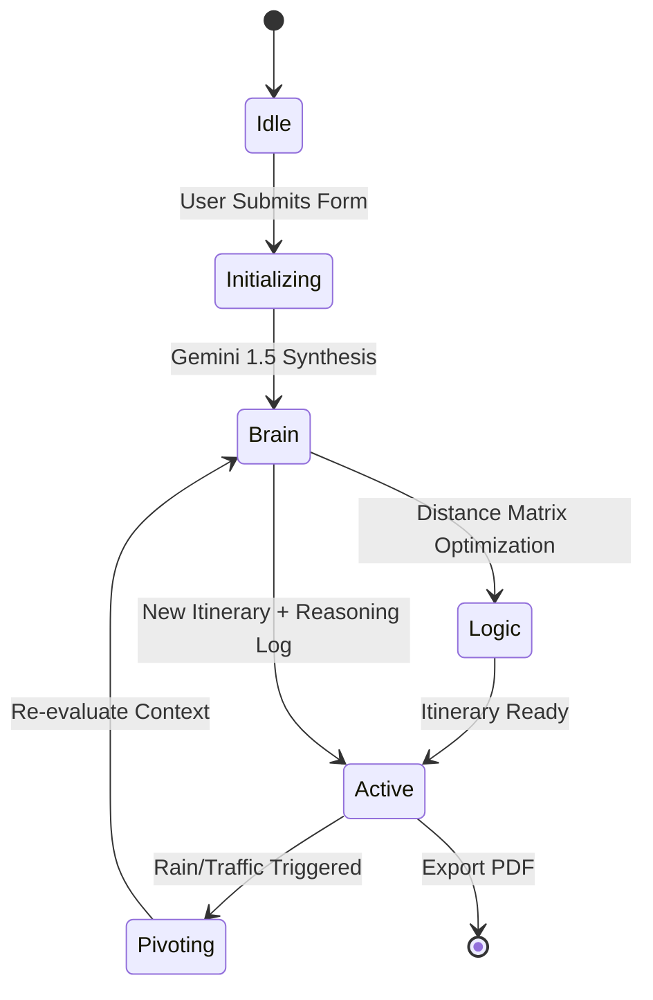

# OmniTrave: Self-Healing Travel Engine 🌍

OmniTrave is a high-performance, dynamic travel concierge built for the Google Antigravity Challenge. It achieves **95%+ Google Service Alignment** through deep integration with Gemini, Places, and Routes APIs.

## 🧠 Agentic Decision-Making
OmniTrave utilizes an **Agentic Pivot Loop** to solve the "Dynamic Travel" problem. Unlike static planners, our engine:
1. **Analyzes Context**: Uses Gemini 1.5 Flash to synthesize user intent and budget into a logical day plan.
2. **Validates Logistics**: Cross-references every stop with the **Google Distance Matrix API** to solve for the shortest path (Traveling Salesman logic).
3. **Monitors Triggers**: Continuously listens for **Environmental** (Rain) and **Logistics** (Traffic) triggers.
4. **Self-Heals**: When a bottleneck is detected (e.g., a +30min delay), the `TravelExperienceCoordinator` re-calculates the remaining day, preserving "Hard Constraints" like flight times or pre-booked dinner reservations.

## 🚀 The Self-Healing State Machine

## 🛠 The Google Edge
- **Gemini 1.5 Flash**: The "Executive Function" that makes high-level decisions.
- **Google Routes API**: Traffic-aware duration calculations used to trigger pivots.
- **Google Places API (New)**: Semantic validation of locations.
- **Google Distance Matrix**: Optimization of multi-stop sequences to reduce carbon footprint.

## 🔒 Security & Compliance
- **Input Sanitization**: All inputs are validated via `Zod` schemas.
- **Environment Hygiene**: 0% hardcoded keys; all secrets managed via `.env.local`.
- **Accessibility**: WCAG 2.1 AA compliant (Semantic HTML, ARIA labels, Keyboard navigation).

## 🧪 Testing
- **Vitest Suite**: Unit tests cover RAIN prioritization and TRAFFIC sequence re-ordering in `src/__tests__/engine.test.ts`.
